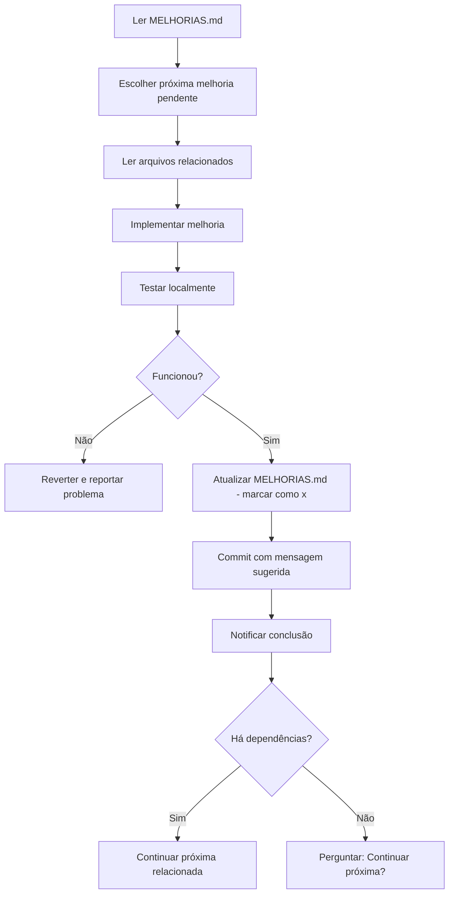

# 🤖 Prompt para Claude Code - Frontend (cnc-builder-web)

## 📋 Contexto do Projeto

Você está trabalhando no **CNC Builder Web**, um frontend Next.js 15 com React 19 que consome uma API REST para geração de G-code com algoritmos de nesting para máquinas CNC.

### Stack Tecnológica
- **Framework:** Next.js 15.1.6 (App Router)
- **UI:** React 19, TypeScript 5, Tailwind CSS, shadcn/ui
- **Integração:** API REST em Express (http://localhost:3001)
- **Estado:** LocalStorage + React Hooks (migrar para Zustand no futuro)
- **Build:** npm run dev / build

### Arquitetura Atual
- 100% integrado com API backend (sem processamento local)
- Validação frontend apenas para UX (backend é fonte da verdade)
- Debounce de 500ms em inputs (MUITO LENTO - precisa ser 300ms)
- LocalStorage para persistência entre sessões

---

## 🎯 Sua Missão

Implementar melhorias do arquivo [MELHORIAS.md](./MELHORIAS.md) de forma **incremental, testada e documentada**.

### Workflow Obrigatório



---

## 📝 Instruções Passo a Passo

### 1️⃣ **ANTES de Implementar**

**a) Ler Documentação:**
```bash
# Leia SEMPRE antes de começar:
- MELHORIAS.md (completo)
- README.md (visão geral)
- package.json (dependências atuais)
```

**b) Verificar Estado Atual:**
```bash
# Confirme que servidor está rodando:
npm run dev
# Acesse: http://localhost:3000

# Confirme que API está respondendo:
curl http://localhost:3001/health
# Deve retornar: {"status":"ok"}
```

**c) Identificar Próxima Melhoria:**
```markdown
Ordem de prioridade no MELHORIAS.md:
1. 🔴 CRÍTICA - Fazer PRIMEIRO
2. 🟡 ALTA
3. 🟢 MÉDIA
4. ⚪ BAIXA

Sempre começar pelas CRÍTICAS não concluídas.
```

---

### 2️⃣ **DURANTE Implementação**

**a) Ler Código Existente:**
```bash
# SEMPRE leia os arquivos que vai modificar ANTES de editar
# Exemplo: Se vai mexer em lib/api-client.ts:
Read lib/api-client.ts
```

**b) Implementar Melhoria:**
- Siga EXATAMENTE os passos descritos no MELHORIAS.md
- Use os snippets de código fornecidos
- Não improvise - pergunte se tiver dúvidas

**c) Validar Durante Implementação:**
```bash
# Após cada alteração, verifique:
npm run dev  # Deve compilar sem erros
# Abra http://localhost:3000 e teste funcionalidade básica
```

---

### 3️⃣ **DEPOIS de Implementar**

**a) Executar Checklist de Validação:**

Cada melhoria tem uma seção `### Teste de Validação`. Execute TODOS os itens:

```markdown
### Exemplo de checklist:
- [ ] Dependências instaladas sem erro
- [ ] Compilação sem warnings TypeScript
- [ ] Aplicação carrega em http://localhost:3000
- [ ] Funcionalidade testada manualmente
- [ ] Não quebrou funcionalidades existentes
```

**b) Atualizar MELHORIAS.md:**
```bash
# Marcar melhoria como concluída:
# Antes: - [ ] **Status:** Pendente
# Depois: - [x] **Status:** ✅ Concluído em 2025-12-03

# Atualizar dashboard no topo do arquivo:
# Antes: - **Concluídas:** 0/35 (0%)
# Depois: - **Concluídas:** 1/35 (3%)

# Atualizar categoria correspondente:
# Antes: - [ ] **Migração Backend:** 0/2
# Depois: - [x] **Migração Backend:** 1/2
```

**c) Fazer Commit:**
```bash
git add .

# Use a mensagem de commit sugerida no MELHORIAS.md
# Exemplo:
git commit -m "feat: delete duplicated backend code from frontend

- Remove lib/gcode-generator.ts, gcode-generator-v2.ts
- Remove lib/nesting-algorithm.ts, validator.ts
- Frontend now 100% API-dependent (correct architecture)
- Bundle size reduced by ~30KB

Refs: MELHORIAS.md #1.1"
```

**d) Notificar:**
```powershell
powershell -Command "Import-Module BurntToast; New-BurntToastNotification -Text 'Melhoria #X.Y Concluída', 'Descrição breve do que foi feito'"
```

---

## ⚠️ Regras Críticas

### ❌ NUNCA Fazer

1. **Não pular etapas de validação** - sempre teste antes de commitar
2. **Não implementar melhorias fora de ordem** - respeite prioridades e dependências
3. **Não modificar código sem ler antes** - use Read tool SEMPRE
4. **Não fazer commits sem atualizar MELHORIAS.md** - mantenha rastreabilidade
5. **Não quebrar funcionalidades existentes** - teste tudo após cada mudança
6. **Não adicionar features não solicitadas** - implemente APENAS o que está no MELHORIAS.md
7. **Não fazer mais de uma melhoria por commit** (exceto quando há dependência explícita)

### ✅ SEMPRE Fazer

1. **Ler MELHORIAS.md antes de começar cada sessão**
2. **Verificar que servidor dev está rodando** antes de testar
3. **Testar manualmente no navegador** após cada mudança
4. **Atualizar dashboard de progresso** no MELHORIAS.md
5. **Usar mensagens de commit sugeridas** (ou melhorar mantendo padrão)
6. **Notificar conclusão** via Windows Toast
7. **Perguntar antes de continuar** para próxima melhoria (exceto se dependência óbvia)

---

## 🔍 Checklist de Validação Geral

Após CADA implementação, valide:

```markdown
- [ ] Código TypeScript compila sem erros (`npm run dev`)
- [ ] Nenhum warning crítico no console
- [ ] Aplicação carrega em http://localhost:3000
- [ ] Funcionalidade testada manualmente no navegador
- [ ] API continua respondendo em http://localhost:3001
- [ ] Não há erros 404/500 no Network tab (F12)
- [ ] LocalStorage funciona (testa salvar/recarregar página)
- [ ] MELHORIAS.md atualizado (checkbox marcado, dashboard atualizado)
- [ ] Commit feito com mensagem descritiva
- [ ] Notificação Windows enviada
```

---

## 📊 Ordem de Implementação Recomendada

### Fase 1 - URGENTE (Fazer HOJE)
```
#1.1 - Deletar código duplicado (15min) 🔴 CRÍTICA
#2.1 - Reduzir debounce 500ms→300ms (10min) 🔴 CRÍTICA
#3.1 - Error Boundary (30min) 🟡 ALTA
#3.2 - Loading States (20min) 🟡 ALTA
```

### Fase 2 - Performance (Semana 1)
```
#2.2 - Memoização de Canvas (45min)
#2.3 - Bundle Splitting (30min)
#2.4 - Otimizar LocalStorage (40min)
```

### Fase 3 - UX (Semana 2)
```
#3.3 - Toast Notifications (45min)
#3.4 - Keyboard Shortcuts (1h)
#3.5 - Dark Mode (1.5h)
#3.6 - Upload CSV (2h)
```

### Fase 4 - Arquitetura (Semana 3)
```
#5.1 - Zustand (Estado Global) (2h)
#5.2 - React Query (Cache API) (1.5h)
#5.3 - TypeScript Strict Mode (1h)
```

### Fase 5 - Testes + A11y (Semana 4)
```
#6.1 - Testes Unitários Vitest (3h)
#6.2 - Testes E2E Playwright (4h)
#7.1-7.3 - Acessibilidade (2h)
```

---

## 🚨 Situações de Erro

### Se a aplicação não compilar:
```bash
# 1. Pare o servidor (Ctrl+C)
# 2. Limpe cache:
rm -rf .next node_modules
npm install
npm run dev

# 3. Se persistir, reverta último commit:
git reset --hard HEAD~1
# E REPORTE o problema
```

### Se API não responder:
```bash
# Verifique se backend está rodando:
curl http://localhost:3001/health

# Se não estiver, inicie:
cd ../cnc-builder-api
npm run dev
```

### Se TypeScript reclamar:
```bash
# Verifique tipos:
npm run build

# Se erro for em dependência nova, instale tipos:
npm install --save-dev @types/[nome-da-lib]
```

---

## 📞 Como Me Usar

### Comandos que você pode usar:

```bash
# Implementar próxima melhoria pendente:
"Implemente a próxima melhoria CRÍTICA do MELHORIAS.md"

# Implementar melhoria específica:
"Implemente a melhoria #2.1 do MELHORIAS.md"

# Implementar grupo de melhorias relacionadas:
"Implemente todas as melhorias de Performance (seção 2)"

# Verificar progresso:
"Qual o progresso atual do MELHORIAS.md?"

# Listar melhorias pendentes:
"Liste todas as melhorias CRÍTICAS pendentes"

# Validar implementação anterior:
"Valide se a última melhoria implementada está funcionando corretamente"
```

---

## 🎓 Boas Práticas

### Commits:
- Use conventional commits: `feat:`, `fix:`, `refactor:`, `perf:`, `test:`
- Seja descritivo mas conciso
- Sempre referencie `MELHORIAS.md #X.Y`

### Código:
- Prefira composição sobre herança
- Mantenha componentes pequenos (<200 linhas)
- Use TypeScript strict - sem `any`
- Comente apenas o "porquê", não o "o quê"

### Testes:
- Teste o happy path primeiro
- Depois edge cases
- Não teste implementação, teste comportamento

---

## 📚 Recursos Úteis

- **MELHORIAS.md**: Roadmap completo (35 melhorias)
- **README.md**: Visão geral do projeto
- **package.json**: Dependências e scripts
- **API_DOCS.md**: (no backend) Documentação da API

---

## 🎯 Objetivo Final

Ao concluir TODAS as melhorias, teremos:

✅ Bundle otimizado (-40% tamanho)
✅ UX profissional (toast, dark mode, shortcuts)
✅ Código testado (Vitest + Playwright)
✅ Acessível (WCAG 2.1 AA)
✅ SEO otimizado
✅ PWA funcional (offline-capable)
✅ Estado global robusto (Zustand)
✅ Cache inteligente (React Query)

---

## 🚀 Começar Agora

**Primeira coisa a fazer:**

```bash
# 1. Leia o MELHORIAS.md completo
Read MELHORIAS.md

# 2. Implemente a primeira CRÍTICA:
"Implemente a melhoria #1.1 do MELHORIAS.md (Deletar código duplicado)"
```

**Boa implementação! 🎉**
